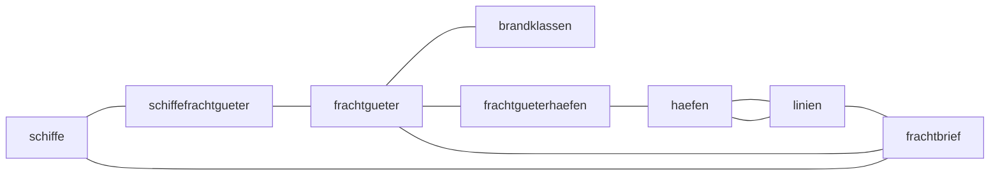

## Tabellen
schiffe (sid, sname, skapitaen)
frachtgueter (fid, fname, bid)
schiffefrachtgueter (sid, fid)
brandklassen (bid, bname)
haefen (hid, hname)
linien (lid, lentfernung, lausgang, lziel)
frachtgueterhaefen (hid, fid)
frachtbriefe (fbid, fabfahrt, fankunft, sif, lid, fid)