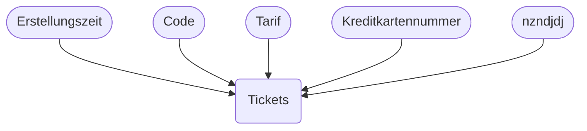

```mermaid
flowchart TD

id1(["Erstellungszeit"])
id2(["Code"])
id3(["Tarif"])
id4(["Kreditkartennummer"])
id5(["nzndjdj"])

tickets("Tickets")

id1 --> tickets
id2 --> tickets
id3 --> tickets
id4 --> tickets
id5 --> tickets
```

