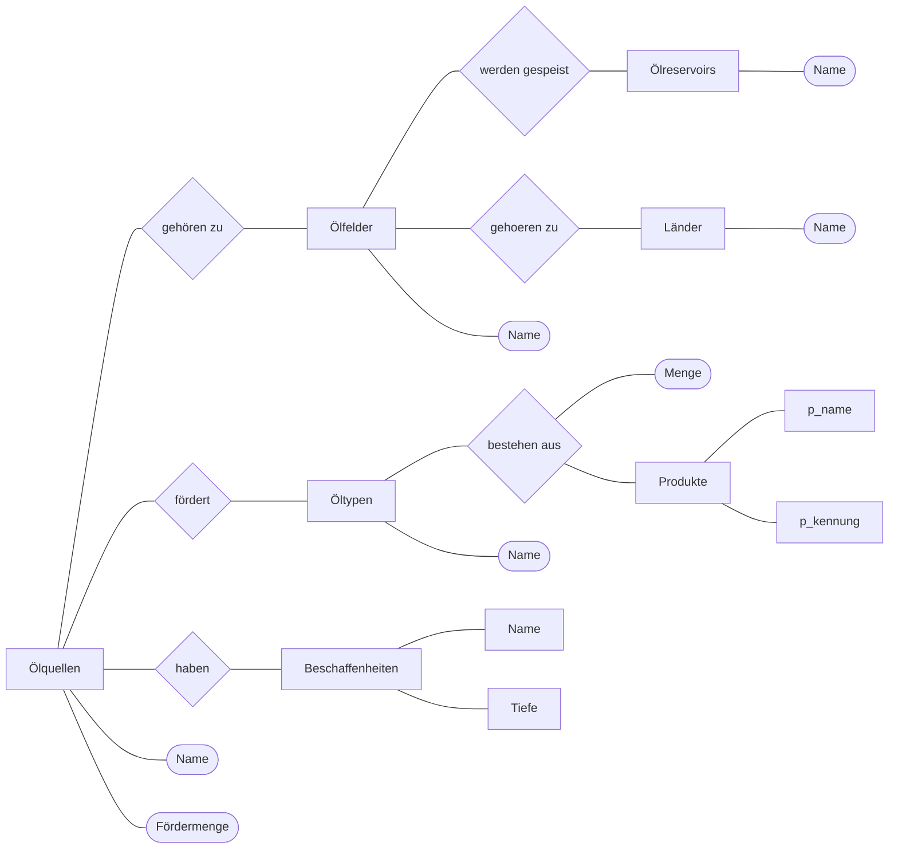

## Grobentwurf

## Feindatenmodell
oelquellen (qid, qbezeichnung(UNIQUE), qmenge, tid)
beschaffenheiten (bid, btiefe, bbeschreibung, gid)
oeltypen (tid, tname)
produkte (pid, pname)
oeltypenprodukte (tpid, tpmenge, tid, pid)
oelfelder (fid, fname, tid, lid)
oelreservoirs (rid, rname)
laender (lid, lname)
