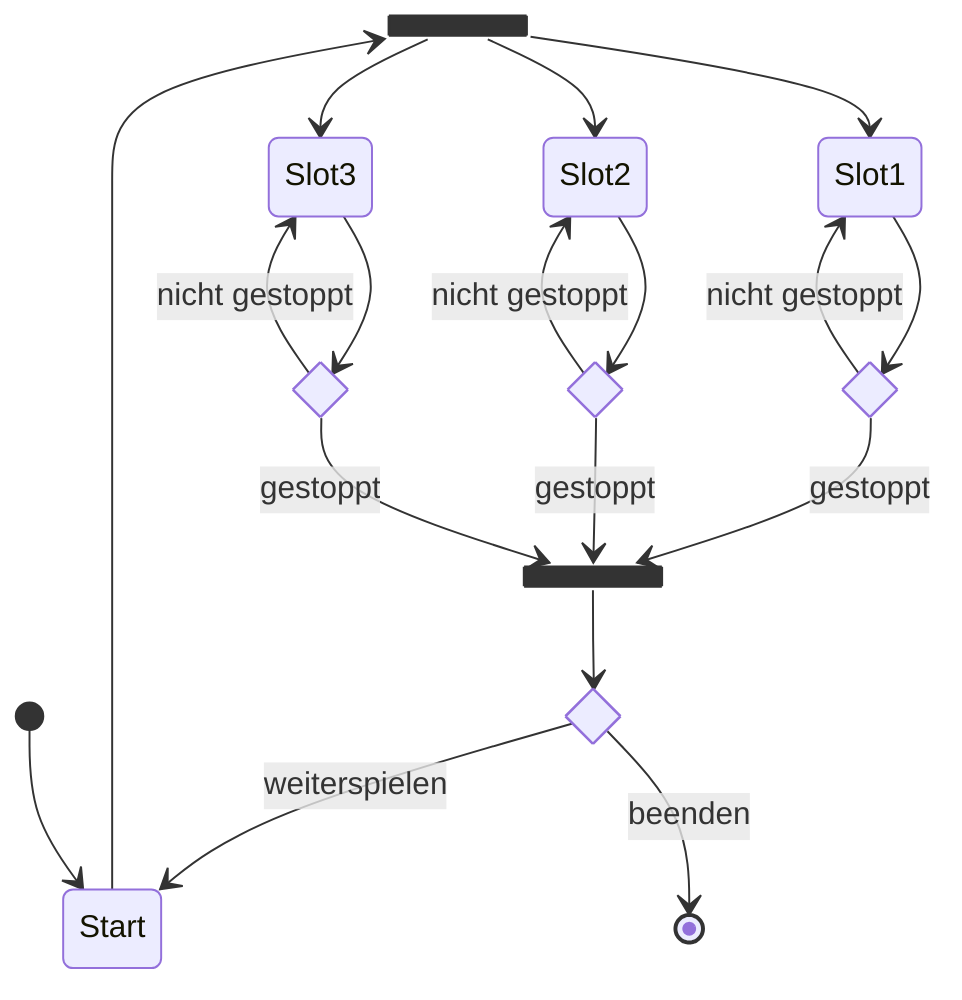
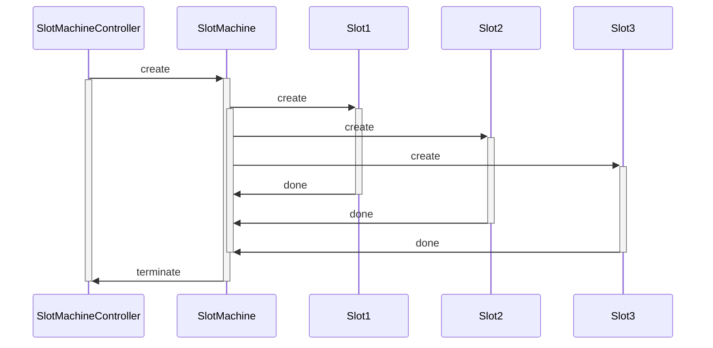

# Aktivitätsdiagramm

```mermaid
stateDiagram

state fork_state <<fork>>
state join_state <<join>>

[*] --> Start
Start --> fork_state
fork_state --> Slot1
fork_state --> Slot2
fork_state --> Slot3

state is_stopped1 <<choice>>
Slot1 --> is_stopped1
is_stopped1 --> join_state: gestoppt
is_stopped1 --> Slot1: nicht gestoppt

state is_stopped2 <<choice>>
Slot2 --> is_stopped2
is_stopped2 --> join_state: gestoppt
is_stopped2 --> Slot2: nicht gestoppt

state is_stopped3 <<choice>>
Slot3 --> is_stopped3
is_stopped3 --> join_state: gestoppt
is_stopped3 --> Slot3: nicht gestoppt

state again <<choice>>
join_state --> again
again --> [*]: beenden
again --> Start: weiterspielen
```

# Sequenzdiagramm

```mermaid
sequenceDiagram

participant SlotMachineController
participant SlotMachine

participant Slot1
participant Slot2
participant Slot3

SlotMachineController ->>+ SlotMachine: create
activate SlotMachineController

SlotMachine ->>+ Slot1: create
activate SlotMachine
SlotMachine ->>+ Slot2: create
SlotMachine ->>+ Slot3: create

Slot1 ->>- SlotMachine: done
Slot2 ->>- SlotMachine: done
Slot3 ->>- SlotMachine: done

deactivate SlotMachine
SlotMachine ->>- SlotMachineController: terminate
deactivate SlotMachineController

```